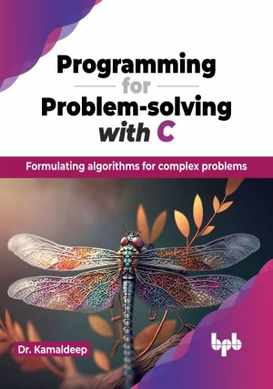

# Programming for Problem-solving with C

This is the repository for [Programming for Problem-solving with C
](https://bpbonline.com/products/programming-for-problem-solving-with-c?variant=43103694946504),published by BPB Publications.

## About the Book
This book equips you with the knowledge of fundamentals of C, a powerful and versatile programming language. It extensively explores the building blocks of computers, software, and algorithms, helping the readers gain a comprehensive understanding of how data is manipulated and solutions are designed.

The readers will learn more about fundamental data types like integers, floats, and characters, master operators and expressions for manipulating data efficiently. We will explore control flow statements like if and for to write structured and logical code, and unlock the power of loops for repetitive tasks. As the book progresses, we will conquer advanced topics like recursion, user-defined functions, dynamic memory allocation, expanding coding skills and tackling complex problems with ease.

This book guarantees knowledge beyond merely learning concept, helping you to acquire expertise required for future job roles. 

## What You Will Learn
• Understand file handling in C for practical application.

• Analyze time and space complexities for optimized algorithm design.

• Navigate decision-making statements and loop structures seamlessly.

• Demonstrate proficiency in array, string, and pointer manipulation.
